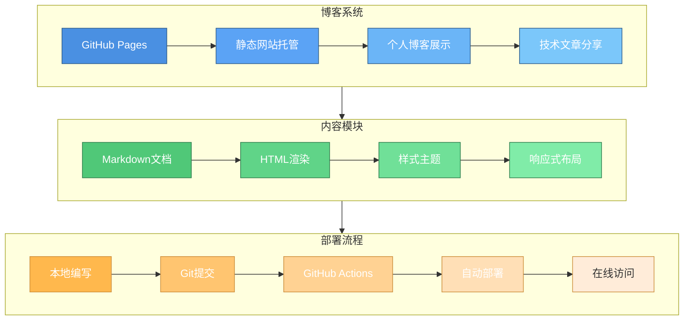

<!--
 * @Author: junw 45444154+wo1261931780@users.noreply.github.com
 * @Date: 2023-03-24 21:21:55
 * @LastEditors: junw 45444154+wo1261931780@users.noreply.github.com
 * @LastEditTime: 2026-03-29 10:00:00
 * @FilePath: \wo1261931780.github.io\README.md
 * @Description: GitHub Pages个人技术博客
 *
 * Copyright (c) 2026 by junw, All Rights Reserved.
-->

# JUNW Blog - 刘佳珺的技术博客

> 📝 基于 Jekyll 构建的个人技术博客,托管于 GitHub Pages

## 🌟 博客简介

这是我的个人技术博客,用于分享技术文章、学习笔记和项目经验。博客采用 Jekyll 静态网站生成器构建,支持:

- 📖 Markdown 文章编写
- 🎨 响应式主题设计
- 💬 Gitalk 评论系统
- 📊 Google Analytics / 百度统计
- 🚀 GitHub Actions 自动部署

## 项目架构



## 🏗️ 技术栈

| 技术 | 说明 |
|------|------|
| **Jekyll** | 静态网站生成器 |
| **Kramdown** | Markdown 解析器 |
| **Rouge** | 代码高亮 |
| **Gitalk** | 评论系统 |
| **GitHub Pages** | 托管平台 |

## 📂 项目结构

```
wo1261931780.github.io/
├── _posts/          # 博客文章
├── _layouts/        # 页面模板
├── _includes/       # 页面组件
├── css/             # 样式文件
├── js/              # JavaScript脚本
├── img/             # 图片资源
├── _config.yml      # Jekyll配置
└── index.html       # 首页
```

## 📝 主要功能

- ✅ 响应式设计,支持移动端访问
- ✅ 文章分类与标签管理
- ✅ Gitalk 评论系统
- ✅ 文章目录自动生成
- ✅ 社交媒体链接
- ✅ PWA 支持

## 🚀 快速开始

### 本地预览

```bash
# 安装 Jekyll
gem install jekyll bundler

# 克隆仓库
git clone https://github.com/wo1261931780/wo1261931780.github.io.git
cd wo1261931780.github.io

# 安装依赖
bundle install

# 启动本地服务
bundle exec jekyll serve

# 访问 http://localhost:4000
```

### 写作新文章

```bash
# 在 _posts 目录创建新文章
# 文件名格式: YYYY-MM-DD-title.md
```

## 📄 License

[](https://www.gnu.org/licenses/agpl-3.0)

本博客采用 GNU Affero General Public License v3.0 协议开源。

## 🔗 相关链接

- 博客地址: https://wo1261931780.github.io
- GitHub: https://github.com/wo1261931780
- Email: wo1261931780@gmail.com
