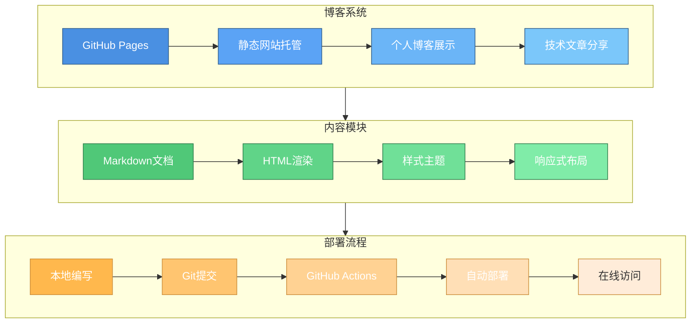

<!--
 * @Author: junw 45444154+wo1261931780@users.noreply.github.com
 * @Date: 2023-03-24 21:21:55
 * @LastEditors: junw 45444154+wo1261931780@users.noreply.github.com
 * @LastEditTime: 2023-03-24 21:30:00
 * @FilePath: \wo1261931780.github.io\README.md
 * @Description: 1111
 *
 * Copyright (c) 2023 by ${git_name_email}, All Rights Reserved.
-->

***我是博客readme***

## 项目架构

